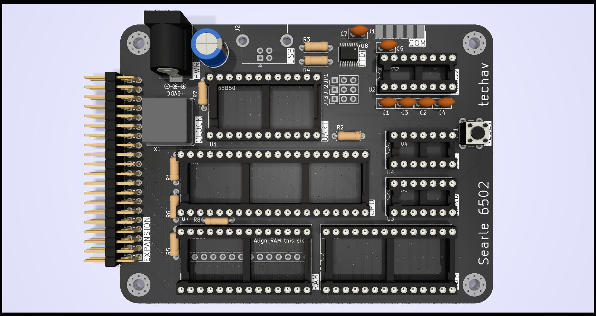

# Minimal-6502
Minimal 6502 SBC based on Grant Searle's 8-chip 6502 computer and laid out as a 4x3" PCB.

Modifications from Grant Searle's design include:
- Addition of expansion header
- Changed clock from crystal to standard TTL can oscillator
- Added option for USB for serial & power via FTDI
- Reassembled software for 8kB EEPROM instead of 16kB EPROM because 27128 EPROM is not readily available (PCB still supports 27128)

